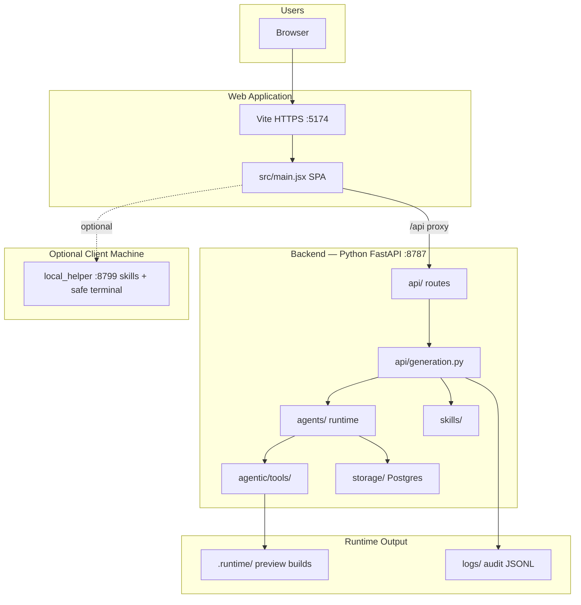
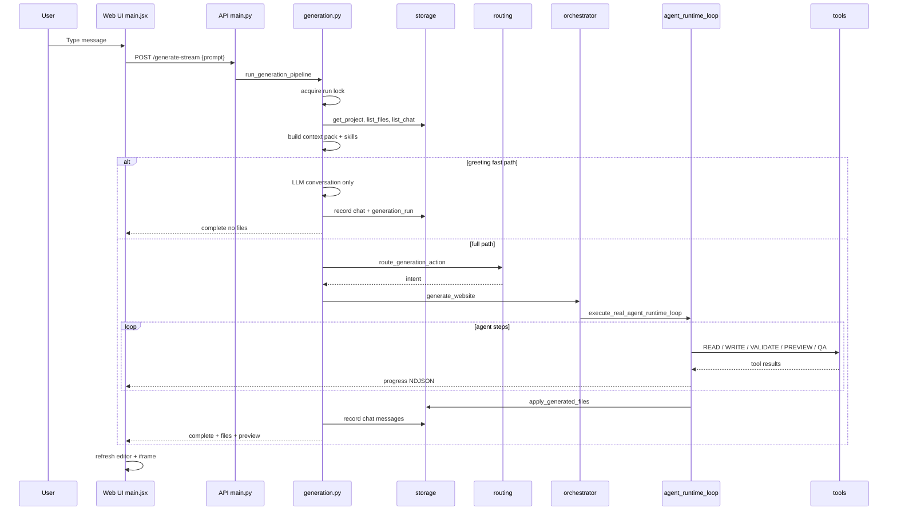
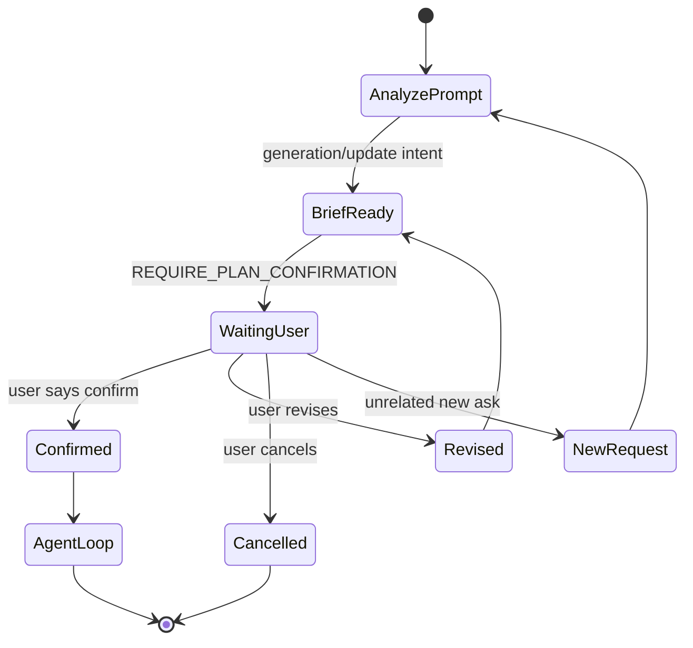
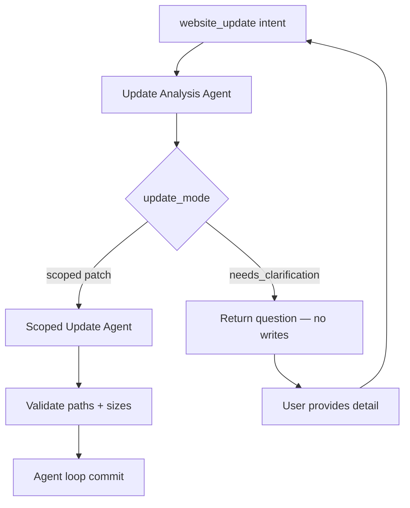
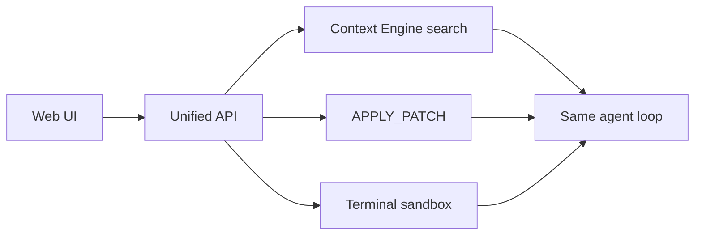

# Web Agent Context Architecture — Full Reference

Complete flowcharts, context limits, and persistence map for worktual_codex web-only operation.

---

## 1. System Boundary Diagram



**No CLI or IDE in this diagram — web is the complete product.**

---

## 2. End-to-End Sequence (One User Message)



---

## 3. Context Pack Detail

### 3.1 Chat history compaction

From `backend/agents/chat_history.py`:

| Constant | Value | Meaning |
|----------|-------|---------|
| `RECENT_FULL_TURNS` | 12 | Full recent user/model pairs |
| `MAX_STORED_HISTORY_MESSAGES` | 80 | Loaded from DB |
| `MAX_OLDER_SUMMARY_CHARS` | 4000 | Summarized older turns |
| `MAX_RECENT_MESSAGE_CHARS` | 12000 | Per recent message trim |
| `MAX_PROJECT_CONTEXT_FILES` | 10 | Live files in context |
| `MAX_PROJECT_CONTEXT_CHARS_PER_FILE` | 3500 | Per file |
| `MAX_PROJECT_CONTEXT_TOTAL_CHARS` | 22000 | Total live code context |

### 3.2 Authoritative instruction

```
STATEFUL_CODE_CONTEXT_INSTRUCTION:
  Conversation history = historical evolution of thought
  CURRENT live code context = authoritative for changes
```

### 3.3 Skills resolution order

From `backend/skills/` discovery:

```text
1. Explicit /skill-name in user message
2. User home ~/.worktual-skills/{system}/
3. Project .worktual/skills/
4. Bundled skills1/ defaults
```

### 3.4 Enhancement and error context

Extracted from chat metadata for follow-up turns:
- `latest_enhancement_context` — prior build/enhance summaries
- `latest_error_context` — local env errors, failures, helper issues

Appended via `append_orchestrator_context()` before orchestrator.

---

## 4. Confirmation Sub-Flow



Module: `backend/agents/requirement_confirmation/`

---

## 5. Update Flow (Existing Code)



Common failure: vague update → `update_clarification` category.

---

## 6. Streaming Event Bridge (Web + v1)

| Legacy stream `type` | v1 `type` | UI shows |
|---------------------|-----------|----------|
| `progress` step=* | `run.progress` / `tool.*` / `gate.*` | AgentProgressStream |
| `complete` | `run.completed` | Files + preview refresh |
| `error` | `run.failed` | ErrorBanner |
| `backend.waiting` | `run.heartbeat` | Thinking indicator |

Modules: `api/generation_stream.py`, `api/v1/events.py`

---

## 7. Persistence Map

| Data | Storage | When written |
|------|---------|--------------|
| Chat messages | Postgres `project_chat_messages` | Each user/model turn |
| Project files | Postgres `project_files` | Save / generation commit |
| Generation runs | Postgres `generation_runs` | Each API call |
| Agent runs | Postgres `agent_runs` | Full agent path |
| Tool calls | Postgres `tool_calls` | Each tool invocation |
| Project memory | Postgres + tool | After successful generation |
| Audit | `logs/YYYY-MM-DD/*.jsonl` | Telemetry events |
| Preview build | `.runtime/projects/` | Preview agent |

---

## 8. Web-Only Capability Matrix

| Task | Supported | Path |
|------|-----------|------|
| Create project | Yes | `POST /api/projects` |
| Auto-create on first message | Yes | `main.jsx` |
| ChatGPT-like chat | Yes | greeting / conversation |
| Generate website | Yes | website_generation |
| Update code | Partial | website_update + scoped |
| Simple code file | Yes | simple_code |
| Skills | Yes | `/skill` + matcher |
| Local folder sync | Yes | import / sync-local |
| Monaco edit | Yes | save file API |
| Preview | Yes | build-preview + iframe |
| Terminal in browser | Weak | local_helper only |
| Codebase @search | No | Phase 2 planned |

---

## 9. Context Maintenance Anti-Patterns

| Anti-pattern | Why bad | Fix |
|--------------|---------|-----|
| Use old chat code as live | Stale edits | Always load `list_files` |
| Skip recording user message | Broken continuity | `record_project_chat_message` |
| Route "hi" to generation | Unwanted file writes | Greeting fast path |
| Vague update without clarify | `update_clarification` failures | Ask file/component |
| Write skills paths in repair | Path policy deny | Validate allowed surface |
| Ignore confirmation state | Wrong commits | Check brief status |

---

## 10. Future Web Enhancements (Same Architecture)



CLI/IDE later attach to same API — web path unchanged.
