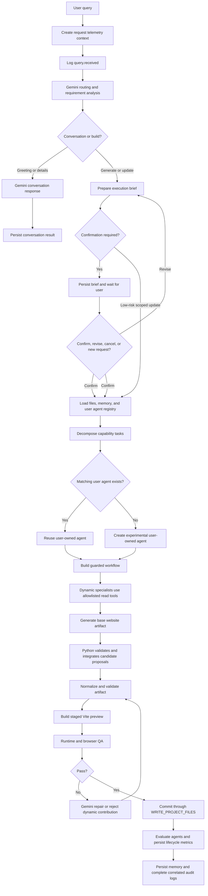

# Worktual AI Dev Dynamic Agent Execution Flow

This is the source-of-truth runtime contract for website generation and code
updates.

## Runtime Contract

- Gemini is the control, conversation, planning, tool-calling, generation,
  review, and repair provider.
- Python is the execution authority. It binds user/project identity, filters
  tools, validates proposals, stages previews, runs QA, performs rollback, and
  commits files.
- Core and reusable specialist agents are global. User-created dynamic agents
  are persisted per user and can be reused only across that user's projects.
- Dynamic agents may request only `READ_PROJECT_FILES` and
  `LOAD_PROJECT_MEMORY`. They can propose candidate file changes but cannot
  write files directly.
- New generation and high-impact updates pause at a persisted execution brief
  until the user explicitly confirms it. Clear low-risk scoped updates may
  continue directly.

## Requirement Confirmation

Gemini prepares an execution brief containing the goal, planned changes,
assumptions, open questions, and protected scope. Python persists that brief per
project and prevents generation, preview, or file writes until Gemini classifies
the next user response as `confirm`.

Other confirmation decisions are `revise`, `cancel`, `new_request`, and
`unclear`. Revisions produce a new brief, cancellations change no files, and an
unclear response keeps the request paused. Configure this behavior with
`REQUIRE_PLAN_CONFIRMATION=true`.

## Flowchart



## Execution Guarantees

1. Conversation-only turns never write project files.
2. Dynamic agents cannot request writes, preview builds, QA, memory writes,
   local sync, deletes, or unknown tools.
3. Model-generated project/user arguments are ignored; Python binds them from
   the authenticated request.
4. Candidate proposals are limited to six allowed project files and 256 KiB
   per file. Invalid paths, duplicate paths, and deletes are rejected.
5. Accepted candidate proposals are integrated before artifact validation.
6. Validation, staged preview, runtime QA, and final commit cannot be skipped.
7. Failed dynamic contributions are evaluated and may be disabled after three
   consecutive failures. Previous project files are restored when the final
   generation path fails.

## Operational Audit

Every request receives a correlation ID and writes supplementary append-only
UTC daily JSONL events:

```text
logs/YYYY-MM-DD/query_model_tool.jsonl
logs/YYYY-MM-DD/dynamic_agents.jsonl
```

The query stream records routing, model usage, tool calls, generation, repair,
preview, QA, commit, completion, and failure. The dynamic-agent stream records
registry lookup, creation, hydration, assignment, execution, proposal
validation, lifecycle evaluation, promotion, and disabling.

Secret-like values and bearer tokens are redacted. Prompt/output previews are
limited and hashed. Generated code and candidate patch bodies are never stored
in file audit logs. Postgres `agent_runs`, `agent_messages`, and `tool_calls`
remain the queryable source of truth.

## Runtime Status

The live executor is `worktual-real-agent-runtime-loop` in
`backend/agents/agent_runtime_loop.py`. Google ADK and LangChain/LangGraph modules
project equivalent metadata but are not the source-of-truth executor.
