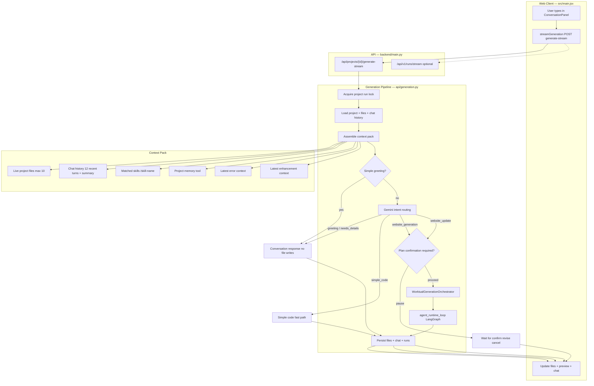
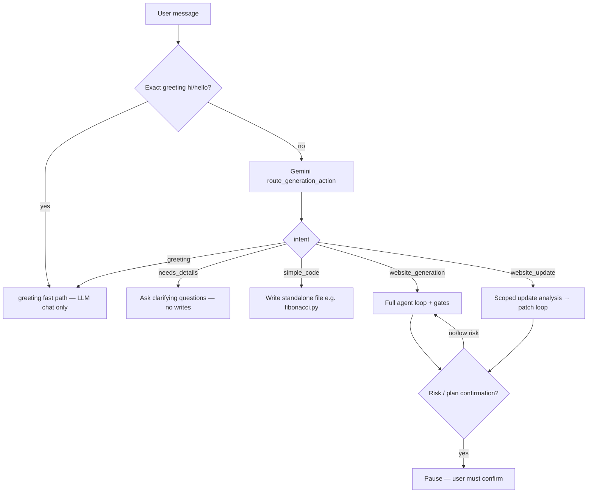
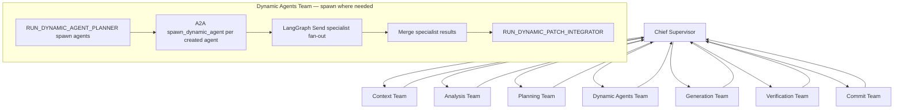
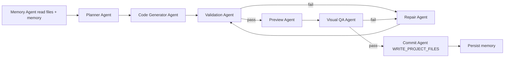

# Web Agent Context Architecture (worktual_codex)

**Product:** Web-only AI coding workspace — no CLI/IDE required.  
**Goal:** Every user input gets the right context; every response stays consistent with live project state.

## When to Apply

Apply this skill **on every worktual_codex task** involving:
- User chat, generation, or code updates in the browser
- Architecture, bugs, or features in backend/frontend agent flow
- Context, memory, skills, or routing decisions
- Explaining what happens when a user sends a message

## Non-Negotiable Context Rules

1. **Live code beats chat history** — `CURRENT LIVE WEBSITE CODE CONTEXT` is authoritative; older chat is historical only (`backend/agents/chat_history.py`).
2. **Backend executes; model proposes** — file writes, preview, commit happen only through Python tools after validation.
3. **One project = one workspace** — `project_id` is the workspace identity in Phase 0 web.
4. **Record every turn** — user + model messages persist via `record_project_chat_message` when available.
5. **Never mix intents** — greeting/chat must not trigger file writes; generation/update must not ignore existing files.

## Master Implementation Plan

**Web roadmap:** [plan.md](plan.md)  
**Platform/backend roadmap:** [../build-codex-cursor-agent-platform/plan.md](../build-codex-cursor-agent-platform/plan.md)

| Tier | Web focus | Status |
|------|-----------|--------|
| 0 | Chat persist, live files, stream reliability | In progress |
| 1 | Episodic memory in context pack | Not started |
| 2 | Patch preview in UI, update clarification | Not started |
| 3 | SEARCH_CODEBASE + AGENTS.md in context | Planned |

**9 concepts on web:** A2A/MAS/LangGraph run in backend; this skill owns **context assembly (#9)**, **routing**, and **UI contract**.

## Master Architecture Flow (Web-Only)



## Per-Message Context Assembly (Always Follow)

Before routing or generating, the pipeline builds this stack (bottom = highest priority for code truth):

| Layer | Source | Module | Limit |
|-------|--------|--------|-------|
| L5 User prompt | Current message | `api/generation.py` | — |
| L4 Skills | `/skill` or matcher | `skills/runtime.py` | matched skills |
| L3b Episodic memory | Last N run summaries | `agents/memory/episodic.py` (Tier 1) | 5 items |
| L3 Enhancement + error | Prior chat metadata | `chat_history.py` | 5k chars each |
| L2 Chat history | Postgres messages | `storage/chat.py` | 12 turns full + older summary |
| L1 Live files | Project file store | `chat_history.build_current_project_context_contents` | 10 files, 22k total |
| L0 System | Routing + agent prompts | `agents/prompting/` | model window |

**Assembly order in code:**
```text
gemini_chat_history =
  build_current_project_context_contents(visible_files)
  + build_gemini_chat_history_contents(raw_chat_history)

effective_prompt = append_orchestrator_context(
  prompt, error_context, enhancement_context, skills_block
)
```

## Intent Routing Decision Tree



| Intent | Writes files? | User experience |
|--------|---------------|-----------------|
| `greeting` | No | ChatGPT-like reply |
| `needs_details` | No | Clarifying questions |
| `simple_code` | Yes (1 file) | Quick code file |
| `website_generation` | Yes (multi) | Full build + preview |
| `website_update` | Yes (scoped) | Edit existing project |

## Hierarchical MAS Runtime (LangGraph)

Default at `AGENTIC_PARITY_TARGET >= 90` (`RUNTIME_GRAPH_TOPOLOGY=hierarchical`).



**When dynamic spawning runs:**
- `website_generation` with `ENABLE_FULL_DYNAMIC_GENERATION` (parity default on)
- `website_update` in agentic scoped-update mode
- **Skipped** for direct-generation fast path (`scope: direct_generation`)

**Modules:**
- `backend/agents/graph_runtime/hierarchical_runtime_graph.py`
- `backend/agents/graph_runtime/dynamic_spawn_runtime.py`
- `backend/agents/graph_runtime/dynamic_team_execution.py`
- `backend/agents/graph_runtime/dynamic_specialists_graph.py` (LangGraph Send workers)

## Agent Runtime Loop (Generation / Update)



**Executor:** `backend/agents/agent_runtime_loop.py`  
**Tools:** `backend/agentic/tools/handlers.py`

## Context Maintenance Checklist (Every User Turn)

Copy and verify mentally on each request:

```text
Context checklist:
- [ ] Which project_id / workspace is active?
- [ ] What files exist NOW (not from old chat)?
- [ ] What did user say in last 12 turns?
- [ ] Any /skill explicit invocation or mismatch?
- [ ] Is this chat-only, new build, or update?
- [ ] If update: is request specific enough (component/file/behavior)?
- [ ] If confirmation pending: confirm / revise / cancel / new_request?
- [ ] Will response change files? If yes, which gates apply?
- [ ] After response: chat + memory + files must stay consistent
```

## User Input → Response Contract

| User says | Expected routing | Files changed | UI updates |
|-----------|------------------|---------------|------------|
| "Hi" | greeting | No | Chat only |
| "Explain React hooks" | greeting/conversation | No | Chat only |
| "Build a CRM landing page" | website_generation | Yes | Files + preview |
| "Change header to dark mode" | website_update | Yes (scoped) | Files + preview |
| "Write prime number in Python" | simple_code | Yes (1 file) | File tree |
| "/greenfield-website ..." | skill + generation | Yes | Files + preview |
| "confirm" (during pause) | resume generation | Yes | Continue stream |
| "cancel" (during pause) | cancel | No | Chat status |

## Web Client Flow (src/main.jsx)

```text
handleChatAction(prompt)
  → streamGeneration(projectId, prompt, model, onProgress)
  → POST /api/projects/{id}/generate-stream
  → handleGenerationStreamLine for each NDJSON event
  → refresh files, previewUrl, chat messages on complete
```

Key constants: `DEFAULT_ASSISTANT_MESSAGE`, `CHAT_PROGRESS_*` filters for user-facing progress.

## Failure Context Routing

When errors occur, attach context for next turn (`chat_history.latest_error_context`):
- `update_clarification` → ask user to specify file/component
- `scoped_update_guard` → explain why patch was blocked
- `backend_generation` → check runtime logs, do not blindly retry
- `gate.failed` / validation → route to repair, preserve live files

## Terminal Agent Testing (phase-wise)

Run agents individually or by phase from the project root:

```bash
python backend/agents/terminal_runners/run_flow.py --list
python backend/agents/terminal_runners/planner_agent.py
python backend/agents/terminal_runners/agent_registry_agent.py --prompt "farm website"
python backend/agents/terminal_runners/run_flow.py --auto --prompt "generate farm website"
```

Each script prints action output, parallel thread details, next node/team, and suggested next script. See `backend/agents/terminal_runners/README.md`.

## Module Map (Source of Truth)

| Concern | File |
|---------|------|
| HTTP entry | `backend/main.py` |
| Pipeline + context assembly | `backend/api/generation.py` |
| Streaming | `backend/api/generation_stream.py` |
| Chat history compaction | `backend/agents/chat_history.py` |
| Skills | `backend/skills/runtime.py` |
| Routing | `backend/agents/orchestration/routing.py` |
| Orchestrator | `backend/agents/orchestration/runner.py` |
| LangGraph hierarchical runtime | `backend/agents/graph_runtime/hierarchical_runtime_graph.py` |
| Dynamic agent spawn policy | `backend/agents/graph_runtime/dynamic_spawn_runtime.py` |
| Dynamic specialists Send graph | `backend/agents/graph_runtime/dynamic_specialists_graph.py` |
| Executor | `backend/agents/agent_runtime_loop.py` |
| Tools | `backend/agentic/tools/handlers.py` |
| Confirmation | `backend/agents/requirement_confirmation/` |
| Web UI | `src/main.jsx` |
| v1 event schema | `backend/api/v1/events.py` |
| Platform capabilities | `GET /api/v1/platform/capabilities` |
| Live runtime trace | `backend/agents/orchestration/live_runtime_trace.py` |
| Episodic memory (planned) | `backend/agents/memory/episodic.py` |

## Agent / Developer Response Template

When answering user questions about the system, use:

```markdown
## User intent
[chat | new build | update | confirm | cancel]

## Active context
- Project: ...
- Live files: ...
- Pending confirmation: yes/no
- Skills: ...

## Flow path
[Which boxes in master diagram apply]

## Expected outcome
[What changes in chat / files / preview]

## If implementing
[Exact modules to touch]
```

## Related Skills

- **Master backend plan:** `build-codex-cursor-agent-platform` → [plan.md](../build-codex-cursor-agent-platform/plan.md)
- Platform roadmap (Codex/Cursor parity): `build-codex-cursor-agent-platform`
- Create new skills: `create-skill`

## Additional Resources

- **Web implementation plan:** [plan.md](plan.md)
- Full flowcharts + context limits: [reference.md](reference.md)
- User scenario examples: [examples.md](examples.md)
- Runtime contract: `backend/AGENTIC_EXECUTION_FLOW.md`
